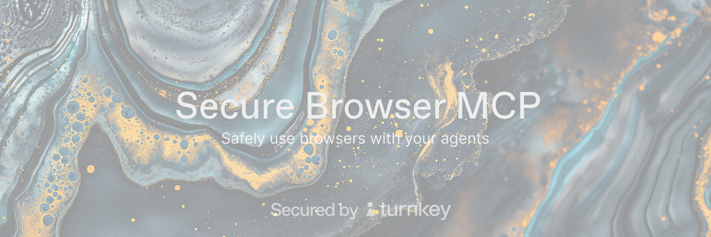

<h4 align="center">
    Safely use browsers with your agents.
</h4>

<p align="center">
  Let an agent log in, check out, and fill any form with credentials it never sees.
</p>

## Features

- **Fill by reference**: The agent holds an opaque secret reference and cannot read the value. It calls `fill_secret`, and the broker injects the plaintext straight into the page over raw CDP
- **Zero context leakage**: The secret never enters the model context, the transcript, or logs. Every tool result passes through a single redaction choke point, and end-to-end tests assert no leak over the wire
- **Destination bindings**: Each secret binds at import to an exact origin, URL pattern, and field selector. A page that talks the agent into filling anywhere else gets a broker-side refusal before any export
- **Consensus approvals**: Turnkey policies decide who must sign an export. A gated fill parks as `pending_approval`; a human approves the activity, and `await_fill` completes the fill. Approvers still cannot read the value — only an ephemeral key held by the broker can decrypt it
- **One approval per form**: A JSON-payload secret (card number, expiry, CVC) fills several fields in one call, under one export and one approval
- **Secure enclave storage**: Credentials live in [Turnkey Secrets](https://docs.turnkey.com/features/secrets), so no single party can access them alone. That includes Turnkey, and it includes the agent
- **Cryptographic audit trail**: Every export request, approver, and destination lands as a signed Turnkey activity you can query
- **Any MCP client**: Point Claude Code, Codex, or any agent framework at the server over stdio
- **Skill and evals included**: Ships with an Agent Skill that teaches agents the workflow and an eval harness that runs real headless agent sessions and hard-fails any leak

## Overview

Secure Browser MCP is an MCP server that acts as a credential broker and owns its own browser. The agent drives the browser through a small set of tools. Passwords, cards, and API keys stay in Turnkey Secrets until a fill passes policy. The broker then exports the secret, decrypts it in its own process memory, and types it into the bound field. The agent sees only `[REDACTED]`.

Ask an agent to buy something. It navigates to checkout and requests the stored card. The card requires a human approver, so the fill pauses until someone signs the export in the Turnkey dashboard. All three card fields fill under that single approval, the payment succeeds, and the card number never appears in any byte the server sent.

There is no `evaluate_script` tool. That is a security decision, not a gap — see [docs/DESIGN.md](docs/DESIGN.md) and [docs/THREAT-MODEL.md](docs/THREAT-MODEL.md).

## Quickstart

```sh
bun install
bun test          # e2e: fills secrets into a local storefront and asserts
                  # the plaintext never appears in server output
bun run dev       # starts the MCP server on stdio
```

The server needs a Chromium-based browser. It checks `SBM_CHROME_PATH` first, then common install locations (Chrome, Chromium, Brave, Edge). Set `SBM_HEADLESS=false` to watch it work.

Connect it to Claude Code:

```sh
claude mcp add secure-browser -- bun run /path/to/secure-browser-mcp/src/index.ts
bun run skill:install -- --claude   # teaches the agent the fill protocol
```

Try it: `bun run demo:fixture` serves a demo storefront at `http://localhost:4173` (login at `/login`, checkout at `/checkout`), pre-wired to seeded mock secrets.

## Backends

The server uses an in-memory mock backend by default. Set these to use real Turnkey Secrets (closed beta):

```sh
export TURNKEY_API_PUBLIC_KEY=...
export TURNKEY_API_PRIVATE_KEY=...
export TURNKEY_ORGANIZATION_ID=...
```

A secret is fillable when it is imported with binding static properties: `sbm:origin` (required), `sbm:url-pattern`, `sbm:selector`, or `sbm:fields` for JSON payloads — see `src/broker/types.ts`. Bindings are immutable after import.

To require approval for exports, add a Turnkey policy whose consensus names both the broker user (its submission is the first vote) and the approver:

```
approvers.any(user, user.id == '<broker-user-id>') && approvers.any(user, user.id == '<approver-user-id>')
```

For a real-world walkthrough — an agent paying a Stripe test checkout with a card it can never read — see [docs/DEMO-STRIPE.md](docs/DEMO-STRIPE.md).

## Agent Skill and evals

`skills/secure-browser/` is an [Agent Skill](https://agentskills.io) that teaches agents the protocol: secrets are handles, binding rejections are policy, pending approvals are normal. Install with `bun run skill:install -- --claude | --codex` (add `--project` for a repo-local install), or copy the folder anywhere a skills-compatible agent looks.

`evals/` runs a real headless agent against the server and grades the transcript: no leakage (hard fail), `fill_secret` used instead of `type_text`, task completed, plus tool-call metrics for spotting regressions. `bun run eval` — see [evals/README.md](evals/README.md).

## Development

| Path             | What it holds                                                                                     |
| ---------------- | ------------------------------------------------------------------------------------------------- |
| `src/broker/`    | Secret refs, the `SecretsClient` interface, Turnkey and mock backends, destination-binding policy |
| `src/browser/`   | Browser ownership and CDP secret injection                                                        |
| `src/redaction/` | The scrub layer every tool result passes through                                                  |
| `src/tools/`     | One file per MCP tool                                                                             |
| `test/fixtures/` | The demo storefront (login, checkout, receipt)                                                    |
| `docs/`          | Design, threat model, Stripe demo walkthrough                                                     |

The Secrets API methods are on `tkhq/sdk` main but not on npm yet, so `vendor/` holds tarballs packed from a local `../sdk` checkout, pinned through `overrides` in `package.json`. Drop them once `@turnkey/sdk-server@8.3.0` ships. To regenerate:

```sh
cd ../sdk && pnpm install && pnpm turbo build --filter=@turnkey/sdk-server --filter=@turnkey/crypto
cd packages/<pkg> && pnpm pack --out ../../../secure-browser-mcp/vendor/turnkey-<pkg>.tgz
```
